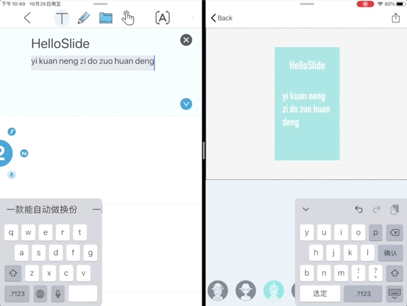
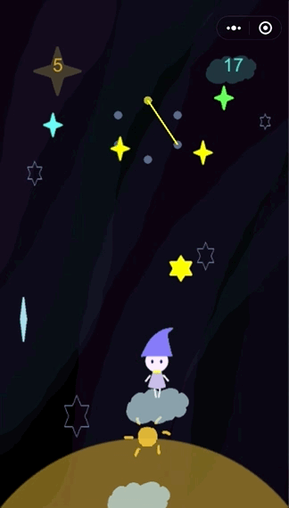
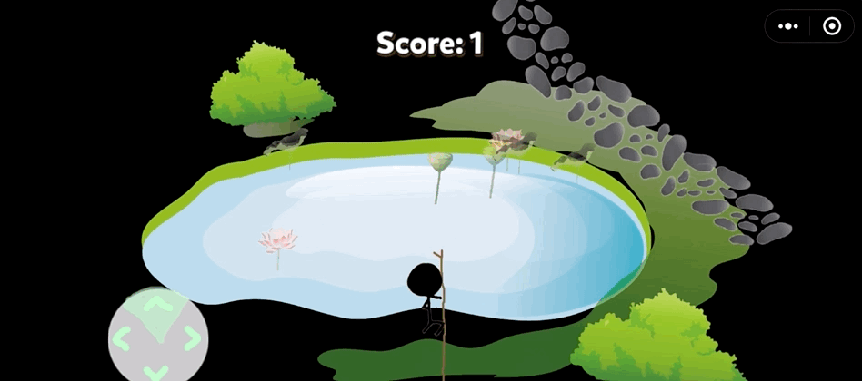

[Back to profile](https://github.com/coconutnutX)

# During master (2021-)

  
Dissecting IPFS and Swarm to demystify distributed decentralized storage networks 
     
     
     
    
    (<a href="https://github.com/dedis/student_22_dissecting_ipfs_swarm">code</a>) (<a href="https://www.epfl.ch/labs/dedis/wp-content/uploads/2023/01/report_2022-3-SixiaoXu-DissectingIPFSandSwarm.pdf">report</a>)
  

  
  1. Analysis of an IPFS gateway dataset.
  2. Monitor IPFS and Swarm clients.

---

Some course projects

  
Advanced computer architecture 
     
    (<a href="https://github.com/coconutnutX/CS470-2022-homework1">code</a>) 
  

  
  - A cycle-by-cycle simulator of an out-of-order processor.

  
Concurrent Algorithms 
    
  

  
  - Implement Dual-versioned STM (software transactional memory).

  
Distributed Algorithms 
     
    (<a href="https://github.com/coconutnutX/CS451-2021-project">code</a>) 
  

  
  - Implement broadcast algorithms based on sockets.

  
Database systems 
     
     
  

  
  - Implement relational operators and execution models.
  - Implement data processing pipelines over Spark.

  
Decentralized Systems Engineering
     
  

  
  - Built a decentralized P2P video sharing platform that allows users to share videos in a secure and trustable manner.
  - Worked on PKI (Public Key Infrastructure) module, implemented signatures, secure message types, and secure broadcast methods.

  
Large-scale data science for real-world data 
     
     
    
  

  
  - 4 homeworks about distributed data processing with Hadoop.
  - Final project about route planning on the Swiss transportation network data using Spark clusters.

  
Machine learning
      
  

  - Text classification.

  
Data visualization 
     
     
     
    (<a href="https://com-480-data-visualization.github.io/datavis-project-2022-nomorebugs/">website</a>)
  

  
  - Design and implement visualizations of several datasets about personality tests.
  - Build a website to show interactive visualizations.

  
Virtual reality 
     
     
    
  

  
  - Design and implement a VR game runs on Oculus Quest.
  
  

# During undergraduate (2017-2021)

Some projects I did/participated in

  
A recommender system 
     
     
     
     
     
     
  

  
  - Internship project on news recommendation.
  - Work on models, frontend and backend with the help of the team.
  

  
Landscape - A simple virtual museum 
    
    
  

  
  

  
An industrial monitoring system 
     
     
     
    
  

  
  - Part of the backend team.
  - Design interface, write documentation and code.

  
HelloSlide - An iOS app for generating slides 
     
     
    
  

  
  - Work on frondend (display and modify template).
  - Work on backend (handwritten text recognition & PPT format export).
  
  

  
Garbage classification robotic arm 
    

  
  - Cooperate with students in telecommunications and remote sensing.
  - Work on image classification.
  
  

  
GETuuuuuP - A mini game 
     
    
  

  
  

  
TheFall - Another mini game 
     
     
    
  

  
  

---

And course projects in

- Software development    
- Data science   
- Embedded system  
